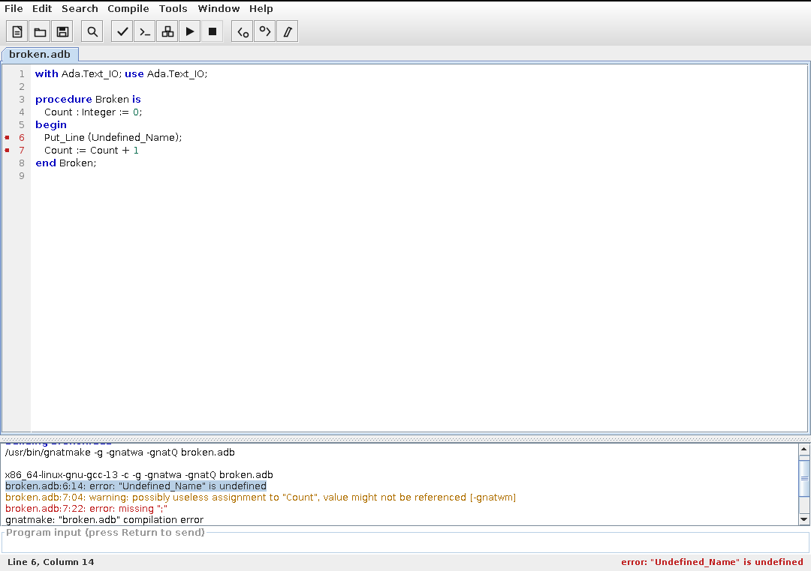

# AdaGIDE para macOS

Entorno de desarrollo para Ada con interfaz gráfica, al estilo del AdaGIDE clásico
(el de Martin Carlisle, que sólo existe para Windows), reescrito para macOS sobre la
cadena de herramientas GNAT.

> **Qué es y qué no es.** El AdaGIDE original es una aplicación Windows escrita en Ada
> contra la API Win32: su binario y su código no son portables a macOS. Esto es una
> reimplementación funcional —mismo flujo de trabajo, mismos botones, mismo ciclo
> editar → compilar → corregir errores → ejecutar— escrita en Java/Swing y empaquetada
> como aplicación nativa de macOS (`AdaGIDE.app` dentro de un `.dmg`).



<sub>Captura tomada en el runner de integración continua (aspecto multiplataforma); en macOS
usa la barra de menús del sistema y el aspecto Aqua.</sub>

## Funciones

- Editor con pestañas, numeración de líneas y resaltado de sintaxis Ada (las 73
  palabras reservadas de Ada 2012, comentarios, cadenas, literales y atributos).
- Auto-indentación por bloques (`is`, `begin`, `loop`, `then`, `declare`, `record`…),
  tabulación configurable y comentar/descomentar la selección.
- Menú **Compile** sobre GNAT:
  - *Check Syntax* → `gcc -c -gnatc`
  - *Compile Unit* → `gcc -c -g`
  - *Build* → `gnatmake -g` (o `gprbuild -P` si hay un `.gpr` en la carpeta)
  - *Build and Run* / *Run Without Building*
  - *Clean* → `gnatclean` / `gprclean`
- Panel de salida con los mensajes del compilador coloreados, marcas en el margen del
  editor y navegación de errores: doble clic en un mensaje, o *Next / Previous Error*,
  lleva el cursor a la línea y columna exactas.
- Ejecución de programas dentro del propio panel (con entrada estándar) o en Terminal.app.
- Búsqueda y sustitución con expresiones regulares, *Go to Line*, archivos recientes,
  plantillas de unidades Ada y de proyecto `.gpr`.
- Integración macOS: barra de menús del sistema, Acerca de / Preferencias / Salir en el
  menú de la aplicación, apertura de archivos `.adb`/`.ads`/`.ada` desde el Finder,
  modo claro y oscuro siguiendo la apariencia del sistema.

## Requisitos

- macOS 11 o posterior (Apple Silicon o Intel).
- Un compilador GNAT. Cualquiera de estos sirve:
  ```sh
  brew install gnat            # Homebrew
  brew install alire           # Alire; luego: alr toolchain --select
  ```
  AdaGIDE busca `gnatmake`, `gcc`, `gprbuild`, `gnatclean` y `gdb` en el `PATH`, en
  `/opt/homebrew/bin`, `/usr/local/bin`, `/opt/gnat/bin` y en las cadenas instaladas por
  Alire. Si no los encuentra, indica la ruta en **Tools ▸ Preferences ▸ GNAT bin directory**
  y compruébalo con **Tools ▸ GNAT Information**.
- Para compilar el proyecto: JDK 21 y Maven. La aplicación empaquetada lleva su propio
  runtime, así que el usuario final no necesita instalar Java.

## Instalación

Descarga el `.dmg` del workflow **macOS DMG** (pestaña *Actions* → artefacto
`AdaGIDE-arm64-dmg` o `AdaGIDE-x86_64-dmg`, o la *release* de la etiqueta `v*`), ábrelo y
arrastra `AdaGIDE.app` a `/Applications`.

El paquete está firmado *ad-hoc*, sin certificado de Apple Developer, así que la primera
vez hay que abrirlo con el botón derecho ▸ *Abrir*, o quitar la marca de cuarentena:

```sh
xattr -dr com.apple.quarantine /Applications/AdaGIDE.app
```

Para firmar con tu propio certificado:

```sh
MAC_SIGN_IDENTITY="Developer ID Application: Tu Nombre (TEAMID)" ./scripts/build-dmg.sh
```

## Compilar desde el código

```sh
mvn package                 # target/adagide.jar
java -jar target/adagide.jar   # ejecución rápida sin empaquetar

./scripts/build-dmg.sh      # dist/AdaGIDE-1.0.0-<arch>.dmg   (sólo en macOS)
TYPE=app-image ./scripts/build-dmg.sh   # dist/AdaGIDE.app, sin imagen de disco
```

`scripts/build-dmg.sh` usa `jpackage`, que sólo genera paquetes macOS *en* macOS. Desde
Linux o Windows, deja que lo construya el workflow
[`packaging/workflows/macos-dmg.yml`](packaging/workflows/macos-dmg.yml): compila en
`macos-14` (arm64) y `macos-13` (x86_64), monta el `.dmg`, verifica el bundle y sube el
resultado como artefacto (y como *release* si empujas una etiqueta `v*`).

### Activar los workflows

Los dos workflows viven en `packaging/workflows/` porque el token con el que se creó esta
rama no tiene permiso para escribir en `.github/workflows/`. Actívalos con un commit tuyo:

```sh
git mv packaging/workflows/macos-dmg.yml .github/workflows/macos-dmg.yml
git mv -f packaging/workflows/build.yml  .github/workflows/build.yml
git commit -m "Activar los workflows de AdaGIDE"
git push
```

`packaging/workflows/build.yml` compila y pasa las pruebas en Ubuntu, instalando GNAT para
que se ejecuten también las de integración. El `git mv -f` lo pone en lugar del workflow de
SonarQube del proyecto anterior, que apunta a un `projectKey` que ya no existe aquí.

## Atajos de teclado

| Acción | Atajo |
| --- | --- |
| Nuevo / Abrir / Guardar | ⌘N / ⌘O / ⌘S |
| Nuevo desde plantilla | ⇧⌘N |
| Cerrar pestaña | ⌘W |
| Buscar y sustituir | ⌘F |
| Ir a línea | ⌘L |
| Comentar / descomentar | ⌘/ |
| Comprobar sintaxis | ⌘K |
| Compilar unidad | ⌘B |
| Construir | ⇧⌘B |
| Construir y ejecutar | ⌘R |
| Ejecutar sin construir | ⇧⌘R |
| Detener | ⌘. |
| Error siguiente / anterior | ⌘E / ⇧⌘E |

## Estructura del repositorio

```
src/main/java/org/adagide/mac/
  AdaGide.java          punto de entrada y configuración macOS
  core/                 preferencias, archivos recientes, plantillas Ada
  build/                localización de GNAT, ejecución de procesos, análisis de errores
  ui/                   ventana, editor, resaltado, panel de salida, diálogos
src/test/java/          pruebas unitarias y de integración con GNAT real
packaging/              icono (.iconset/.icns), asociaciones de archivo, generador del icono
scripts/build-dmg.sh    empaquetado con jpackage
scripts/make_icns.py    reconstruye el .icns sin macOS (equivalente a iconutil)
```

## Pruebas

```sh
mvn test
```

`GnatPipelineIT` compila y ejecuta programas Ada de verdad cuando hay un GNAT instalado;
si no lo hay, se omite automáticamente.
